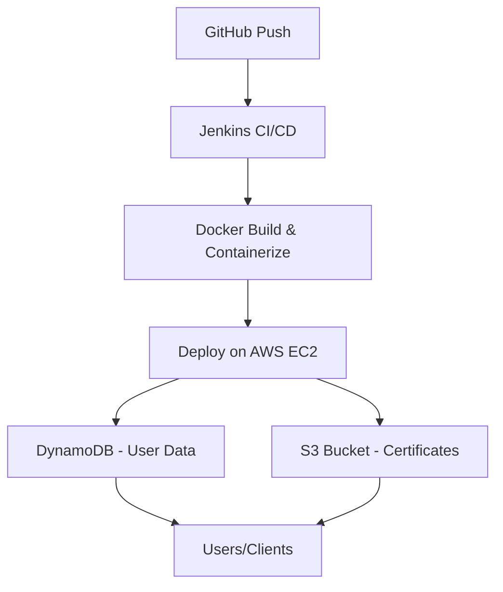

# Student Certificate Portal

> A complete portal to manage student data and certificates with modern **frontend, backend, security, cloud, and DevOps** integrations.

---

## Table of Contents

1. [Project Overview](#project-overview)
2. [Frontend Implementation](#frontend-implementation)
3. [Backend Implementation](#backend-implementation)
4. [Security Features](#security-features)
5. [AWS Cloud Integration](#aws-cloud-integration)
6. [DevOps Implementation](#devops-implementation)
7. [Deployment Flow](#deployment-flow)
8. [API Endpoints](#api-endpoints)
9. [Architecture & Diagrams](#architecture--diagrams)
10. [Screenshots](#screenshots)
11. [License](#license)

---

## Project Overview

The **Student Certificate Portal** is a full-stack system enabling:

* **Student management** (CRUD operations)
* **Certificate uploads and downloads**
* Secure **cloud storage and backend**
* Automated **DevOps pipeline** for CI/CD

**Tech Stack**:

| Layer    | Technology/Service                  |
| -------- | ----------------------------------- |
| Frontend | React.js + TypeScript + TailwindCSS |
| Backend  | Node.js + Express + DynamoDB        |
| Storage  | AWS S3                              |
| DevOps   | Docker + Jenkins + AWS EC2          |
| Security | HTTPS, JWT, CORS, Pre-signed URLs   |
| CI/CD    | Jenkins pipeline                    |

---

## Frontend Implementation

**Features**:

* React + TypeScript for robust, type-safe frontend
* TailwindCSS for styling
* File upload components connecting to **AWS S3** via pre-signed URLs
* Login & user management forms

**Optional Screenshot:**
`// Screenshot: Frontend login page / certificate upload form`

---

## Backend Implementation

**Key Features**:

* Node.js + Express REST API
* CRUD operations with **DynamoDB**
* Pre-signed URL generation for **S3 file uploads**
* Environment-driven configuration (`.env`)

**Optional Screenshot:**
`// Screenshot: Backend running on EC2 or Postman API testing`

---

## Security Features

* HTTPS for secure communication
* **JWT authentication** for protected routes
* CORS enabled for frontend-server communication
* Pre-signed URLs ensure **temporary and secure access** to S3 files
* Input validation for forms and APIs

**Optional Screenshot:**
`// Screenshot: JWT login response or HTTPS configuration`

---

## AWS Cloud Integration

| Service  | Purpose                                |
| -------- | -------------------------------------- |
| DynamoDB | Stores all user & certificate metadata |
| S3       | Stores uploaded certificate files      |
| EC2      | Hosts Dockerized backend container     |

**Optional Screenshot:**
`// Screenshot: DynamoDB table / S3 bucket console view`

---

## DevOps Implementation

**Highlights**:

* **Docker**: Containerized backend
* **Jenkins CI/CD**: Automated build, test, and deployment pipeline
* **EC2 Deployment**: Docker container deployed and updated via Jenkins

**Pipeline Flow**:

```text
Developer pushes code → Jenkins triggers pipeline → Docker image built → EC2 container updated → Backend connected to DynamoDB & S3 → Users can upload certificates
```

**Optional Screenshot:**
`// Screenshot: Jenkins pipeline execution / Docker container status`

---

## Deployment Flow Diagram



---

## API Endpoints

| Method | Endpoint          | Description                    |
| ------ | ----------------- | ------------------------------ |
| GET    | `/`               | Test route                     |
| GET    | `/users`          | Fetch all users from DynamoDB  |
| POST   | `/users`          | Add a new user                 |
| GET    | `/get-upload-url` | Generate pre-signed URL for S3 |
| POST   | `/upload`         | Upload file to S3 using URL    |

---

## Architecture & Diagrams

**High-Level Architecture**:

```
Frontend (React)  -->  Backend (Node.js/Express)  -->  AWS (DynamoDB + S3)
      |                   |                             |
      v                   v                             v
  Users/Clients      CI/CD via Jenkins               Secure Cloud Storage
```

**Optional Diagram Ideas**:

* File upload flow from frontend → S3 → DynamoDB
* Jenkins pipeline stages: Build → Test → Deploy

---

## Screenshots

> Add your actual screenshots here. Comments indicate what they should be:

1. **Frontend Pages**
   `// Login page, dashboard, certificate upload`

2. **Backend / APIs**
   `// Postman test results, server logs, running backend on EC2`

3. **AWS Cloud**
   `// DynamoDB user table, S3 bucket view`

4. **DevOps Pipeline**
   `// Jenkins stages, Docker container logs, deployment dashboard`

---

## License

MIT License

---
